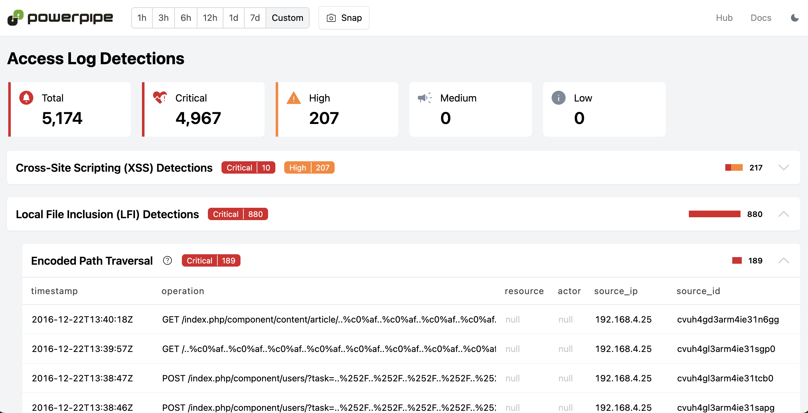

# Nginx Plugin for Tailpipe

[Tailpipe](https://tailpipe.io) is an open-source CLI tool that allows you to collect logs and query them with SQL.

[Nginx](https://nginx.org/) is a popular open-source web server that can also be used as a reverse proxy, load balancer, mail proxy, and HTTP cache.

The [Nginx Plugin for Tailpipe](https://hub.tailpipe.io/plugins/turbot/nginx) allows you to collect and query Nginx access logs using SQL to track activity, monitor trends, detect anomalies, and more!

- **[Get started →](https://hub.tailpipe.io/plugins/turbot/nginx)**
- Documentation: [Table definitions & examples](https://hub.tailpipe.io/plugins/turbot/nginx/tables)
- Community: [Join #tailpipe on Slack →](https://turbot.com/community/join)
- Get involved: [Issues](https://github.com/turbot/tailpipe-plugin-nginx/issues)

Collect and query logs:


## Getting Started

Install Tailpipe from the [downloads](https://tailpipe.io/downloads) page:

```sh
# MacOS
brew install turbot/tap/tailpipe
```

```sh
# Linux or Windows (WSL)
sudo /bin/sh -c "$(curl -fsSL https://tailpipe.io/install/tailpipe.sh)"
```

Install the plugin:

```sh
tailpipe plugin install nginx
```

Configure your table partition and data source:

```sh
vi ~/.tailpipe/config/nginx.tpc
```

```hcl
partition "nginx_access_log" "my_logs" {
  source "file" {
    paths       = ["/var/log/nginx/access/"]
    file_layout = `%{DATA}.log`
  }
}
```

**Note**: By default, the `nginx_access_log` table can collect logs using the combined log format. If your logs use a custom log format, please see [Collect logs with custom log format](https://hub.tailpipe.io/plugins/turbot/nginx/tables/nginx_access_log#collect-logs-with-custom-log-format).

Download, enrich, and save logs from your source ([examples](https://tailpipe.io/docs/reference/cli/collect)):

```sh
tailpipe collect nginx_access_log
```

Enter interactive query mode:

```sh
tailpipe query
```

Run a query:

```sql
select
  remote_addr,
  request_method,
  request_uri,
  status,
  count(*) as request_count
from
  nginx_access_log
group by
  remote_addr,
  request_method,
  request_uri,
  status
order by
  request_count desc;
```

```sh
+---------------+----------------+------------------+--------+---------------+
| remote_addr   | request_method | request_uri      | status | request_count |
+---------------+----------------+------------------+--------+---------------+
| 192.168.1.100 | GET            | /api/users       | 200    | 15243         |
| 10.0.0.50     | POST           | /api/login       | 401    | 8721          |
| 172.16.0.25   | GET            | /static/main.css | 304    | 5432          |
+---------------+----------------+------------------+--------+---------------+
```

## Detections as Code with Powerpipe

Pre-built dashboards and detections for the Nginx plugin are available in [Powerpipe](https://powerpipe.io) mods, helping you monitor and analyze activity across your Nginx servers.

For example, the [Nginx Access Log Detections mod](https://hub.powerpipe.io/mods/turbot/tailpipe-mod-nginx-access-log-detections) scans your Nginx access logs for anomalies, such as a high number of failed login attempts.

Dashboards and detections are [open source](https://github.com/topics/tailpipe-mod), allowing easy customization and collaboration.

To get started, choose a mod from the [Powerpipe Hub](https://hub.powerpipe.io/?engines=tailpipe&q=nginx).



## Developing

Prerequisites:

- [Tailpipe](https://tailpipe.io/downloads)
- [Golang](https://golang.org/doc/install)

Clone:

```sh
git clone https://github.com/turbot/tailpipe-plugin-nginx.git
cd tailpipe-plugin-nginx
```

After making your local changes, build the plugin, which automatically installs the new version to your `~/.tailpipe/plugins` directory:

```sh
make
```

Re-collect your data:

```sh
tailpipe collect nginx_access_log
```

Try it!

```sh
tailpipe query
> .inspect nginx_access_log
```

## Open Source & Contributing

This repository is published under the [Apache 2.0](https://www.apache.org/licenses/LICENSE-2.0) (source code) and [CC BY-NC-ND](https://creativecommons.org/licenses/by-nc-nd/2.0/) (docs) licenses. Please see our [code of conduct](https://github.com/turbot/.github/blob/main/CODE_OF_CONDUCT.md). We look forward to collaborating with you!

[Tailpipe](https://tailpipe.io) is a product produced from this open source software, exclusively by [Turbot HQ, Inc](https://turbot.com). It is distributed under our commercial terms. Others are allowed to make their own distribution of the software, but cannot use any of the Turbot trademarks, cloud services, etc. You can learn more in our [Open Source FAQ](https://turbot.com/open-source).

## Get Involved

**[Join #tailpipe on Slack →](https://turbot.com/community/join)**

Want to help but don't know where to start? Pick up one of the `help wanted` issues:

- [Tailpipe](https://github.com/turbot/tailpipe/labels/help%20wanted)
- [Nginx Plugin](https://github.com/turbot/tailpipe-plugin-nginx/labels/help%20wanted)
